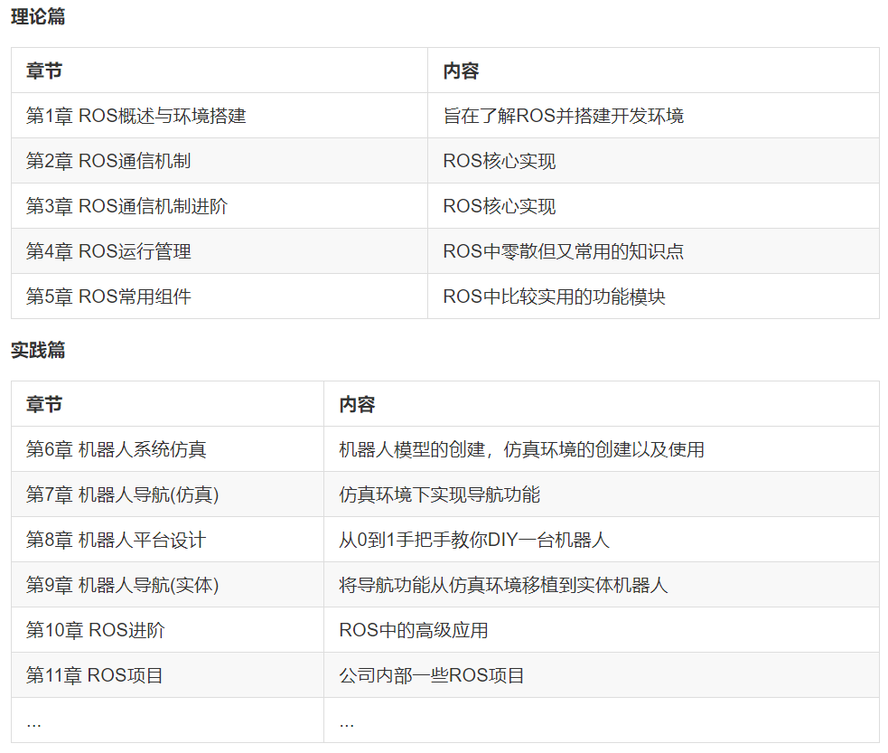

# 前言

我们的作业就跟紧Autolabor的系列教程，为大家打好这部分的基础。

#### 注意：这里默认大家已经学会了类和指针。

简单看一下目录：

我们重点学会的章节有1，2，4，5，6即可，其他同学们可以自己去拓展

好了，现在我们开始布置第一次的作业吧。

## 关键词：话题通信

编写一个ROS节点，该节点订阅名为“input_topic”的字符串类型话题，并将其转换为大写字母，并通过名为“output_topic”的新话题发布结果。例如，如果输入是“hello world”，那么输出应该是“HELLO WORLD”。

要求：

1. 订阅的话题名称为“input_topic”，消息类型为std_msgs::String。
2. 发布的话题名称为“output_topic”，消息类型为std_msgs::String。
3. 节点名称应为“string_converter”。
4. 使用C++编写节点。

提示：

1. 可以使用ROS的StringTools库实现字符串转换。
2. 可以使用ROS的NodeHandle库函数访问话题。
3. 记得写callback函数

时间：3天
